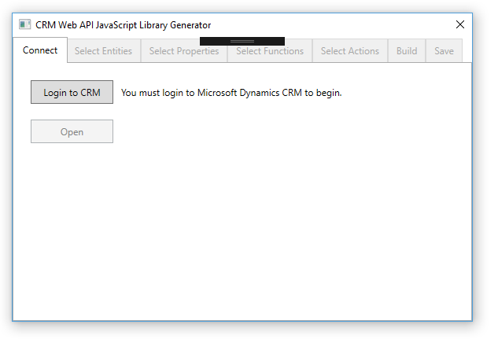
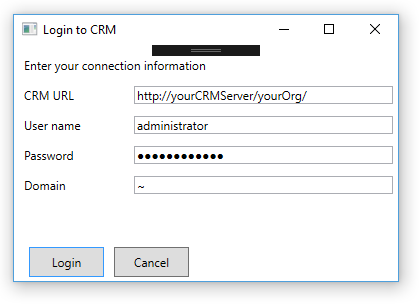
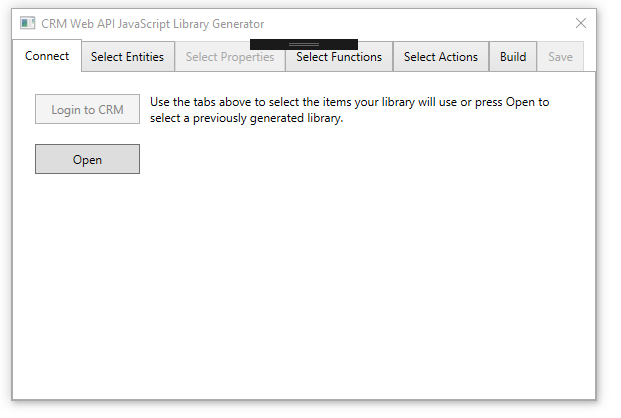
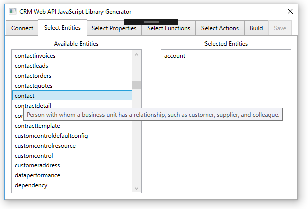
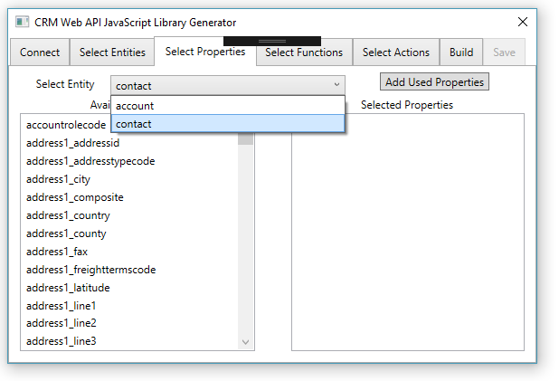
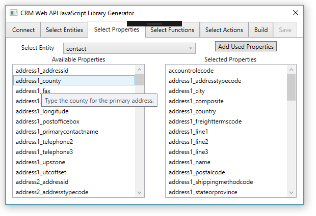
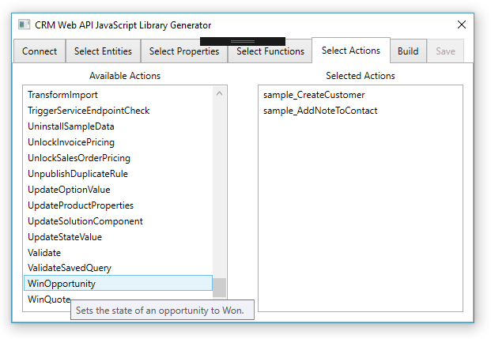
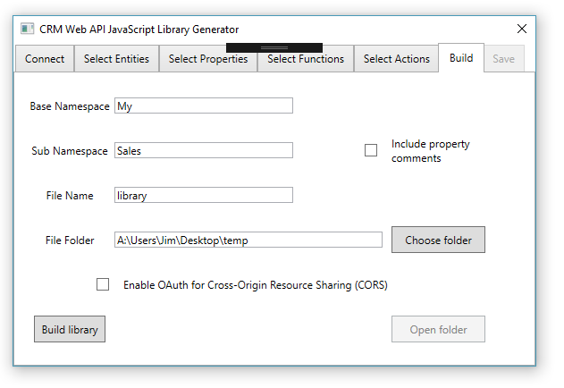
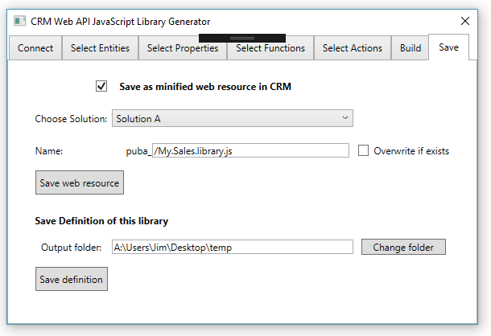
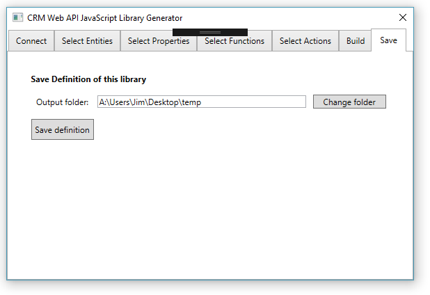

# CRM JavaScript Web API Service Utility
A WPF application which generates a custom JavaScript library 
and companion TypeScript definition file to provide a robust design-time
experience with Visual Studio 2015 when writing client-side JavaScript to perform operations using the 
Microsoft Dynamics CRM Web API.
## In this README
* [When to use this utility](#when-to-use-this-utility)
* [What this utility provides](#what-this-utility-provides)
* [Limitations](#limitations)
* [How to use this utility](#how-to-use-this-utility)
* [About this project](#about-this-project)
* [Release Notes](#release-notes)

## When to use this utility
You have many options to write JavaScript code that uses the CRM Web API. This one
is designed to provide a design-time experience which takes advantage of 
the capabilities of Visual Studio to provide auto-completion for defined types and 
in-line IntelliSense documentation as well as other advantages to increase your 
productivity.

In order to provide this experience this application will read Microsoft Dynamics CRM
metadata and Web API $metadata from your CRM organization and allow you to choose 
which entities, entity properties, and Web API Functions or Actions you intend to use
with the library generated by this application.

The core generated library is 91KB (27KB minified) and will grow as you choose to add more 
definitions for the entities and operations you need.
The size of [jquery-3.1.0.min.js](https://code.jquery.com/jquery-3.1.0.min.js) 
is 85KB by comparison. 

Adding definitions for **all** entities, entity properties, and operations is not realistic
because the generated library would be **huge**: over 8,000KB at more than 158200 lines of code.
But no one needs a library to support every possible entity, entity property, or operation available.
> **Important**: You should choose only those entities, entity properties and operations
you will actually use in your project to mitigate the performance cost of the 
initial load of the library. 

Of course, once the library is cached in the user's browser
this 'cold-load' cost will be eliminated until you edit the library or the cache expires.

The library generated by this utility should be ideal for complex HTML web resource or 
Single Page Applications (SPA). This library may also be appropriate if the 
customizations in your Microsoft Dynamics CRM solution include a lot of code that performs 
operations with CRM data using the Web API. However, if you are making a single Web API
call from a form script or ribbon command, you should consider more light-weight 
options such as the following:
* [CRM REST Builder](https://crmrestbuilder.codeplex.com/)
* [davidyack/Xrm.Tools.CRMWebAPI ](https://github.com/davidyack/Xrm.Tools.CRMWebAPI)
* [mariusso/WebAPI.REST.js](https://github.com/mariusso/WebAPI.REST.js)

[Go to Top](#in-this-readme)
## What this utility provides
* A TypeScript definition file for the generated JavaScript library. You can use the JavaScript library 
directly or the TypeScript definition in a TypeScript project.
* Option to generate a version of the library which includes [adal.js](https://github.com/AzureAD/azure-activedirectory-library-for-js) 
and necessary changes to use the library in a Single Page Application (SPA) that uses OAuth with Cross-Origin Resource Sharing (CORS). 
See [Use OAuth with Cross-Origin Resource Sharing to connect a Single Page Application to Microsoft Dynamics CRM](https://msdn.microsoft.com/en-us/library/mt595799.aspx)
* Entity classes with get/set properties for the entities and properties you choose. Try to set a read-only property
or use the wrong data type and you will get an error. This is a good thing.
* Functions for any Web API Functions or Actions you choose, including custom actions.
* Automatic detection of dependent entities, complex types, and enum types.
    * If you choose a bound Web API Function or Action, the entities bound to it are included.
    * The complex types returned by any Web API Function or Action are included.
    * Any complex types or enum required to pass as parameters to Web API Functions or Actions 
    is included. This is a recursive detection so even dependencies many layers deep are detected.
* The following core functions are available for operations with entities:
    * **create**: Create a new entity in CRM. Returns the URI to the entity.
    * **createAndRetrieve**: Create and retrieve: Two operations wrapped in one function.
    * **createAndRetrieveTypedEntity**: Returns a typed entity.
    * **retrieve**: Retrieve the JSON data for an entity
    * **retrieveTypedEntity**: Returns a typed entity.
    * **retrieveProperty**: Returns the value of a specific property
    * **update**: Updates an entity. 
    * **upsert**: Allows for an update or insert, with the option to prevent update.
    * **delete**: (**deleteEntity** in TypeScript since it is pickier about keywords than JavaScript)
    * **addToCollection**: Adds an entity to a collection-valued navigation property (N:N or N:1). There are helper methods to set single-valued navigation properties (AKA Lookups).
    * **disassociate**: Disassociates any kind of relationship (N:N,N:1,or 1:N)
    * **query**: Provides ability to query and retrieve multiple entities and set page size.
    * **getNextPage**: Provides ability to retrieve the next page from a query operation when paging is set.
    * **executeFetch**: Executes a FetchXml query.
* All core operations or generated functions are asynchronous and return es6 promises. An es6 promise polyfill is downloaded and included in 
the library to support IE 11 which doesn't support native promises.
* The entire library is a single file to eliminate issues caused by the asynchronous loading of custom libraries in parallel.  
in the CRM web application. 
* All entity classes inherit from a crmbaseentity class which provides the following methods:
    * **getUri**: Returns the URI for a retrieved or saved entity
    * **getId**: Returns the GUID Id value of the retrieved or saved entity
    * **setIdFromUri**: Sets the Id value from a Uri. You can also pass the Uri to the entity constructor.
    * **getRef**: Returns an object with an @odata.id property representing an entity reference.
    * **getVersion**: Returns the version of the retrieved entity for use with [conditional operations](https://msdn.microsoft.com/en-us/library/mt607711.aspx).
    * **getFormattedValue**: Returns the formatted value of an entity property
    * **getColumnSet**: Returns a string array of the properties of an entity defined by your library. Convenient since both 
    **retrieve** and **query** require a string array of properties to set the **$select** system query option.
    * **get**: Allows for getting the value of an entity property not included in your library definition.
    * **set**: Allows for setting the value of an entity property not included in your library definition.
    * Methods for each single-valued navigation property included in the library definition for an 
    entity. This allows for an IntelliSense discoverable way to set these properties since the @odata.bind annotation doesn't
    play well with IntelliSense.
* Each entity tracks which properties have changed so that when you update a previously retrieved 
entity, only the properties you have actually changed are included in the update operation.
    * This is achieved with a custom **toJSON** method on the entity. This method is called when 
    [JSON.stringify](https://msdn.microsoft.com/library/cc836459(v=vs.94).aspx) is used to serialize the data for the request.
* The constructor for all entity classes accept the following options to instantiate an entity instance:
    * A string representation of a GUID value to set the ID for an entity.
    * A Uri to an existing entity to set the ID for an entity.
    * An OData entity reference to set the ID for an entity.
    * A JSON object to initialize the property values for an entity. When this is done, all properties are set as changed 
    and will be sent when you update the entity. If this is not what you want, the entity has a **resetChangeTracking** method 
    to set all properties as unchanged.
* Metadata information such as [EntitySetName](https://msdn.microsoft.com/en-us/library/microsoft.xrm.sdk.metadata.entitymetadata.entitysetname.aspx) 
and the names of entity relationships so you don't need to look them up. 
    * All the relationships between any entities in your library definition are included.
automatically.
* Descriptions of the entities, entity properties, Web API Functions and Actions and their parameters
 as code comments. These descriptions provide the integer values and labels for 
optionset properties so you don't have to look them up. These comments are removed when the library is minified.
* Option to upload the minified library as a JavaScript web resource to the solution of your choice
* Option to save a definition of your library configuration so you can re-load it when you want to edit it in the future.

[Go to Top](#in-this-readme)
## Limitations
The following are known limitations of the generated library:
* Provides no methods or helpers to execute batch operations.
* Does not support operations to query or edit entity metadata. These behave differently, for example they don't support using PATCH for update. See [Use the Web API with CRM metadata](https://msdn.microsoft.com/en-us/library/mt607833.aspx).
* Does not provide an alternative interface to define query filters or orders using either the OData system query 
options or [CRM Query Functions](https://msdn.microsoft.com/en-us/library/mt607843.aspx). 
You have to compose these as strings.
* Does not provide alternative to defining $filter or $select properties for expanded entities. See 
[Retrieve related entities for an entity by expanding navigation properties](https://msdn.microsoft.com/en-us/library/mt607871.aspx#bkmk_expandRelated)
* Including property comments in the JavaScript library has been known to cause the Visual Studio JavaScript language service to crash.
Including these comments in the generated JavaScript library is not enabled by default. This is not an issue when using the TypeScript definition, so they are always included there.
* Not all descriptions for OOTB types are complete. They are marked by TODO in the descriptions.
* Does not provide functionality to support alternate keys.

[Go to Top](#in-this-readme)
## How to use this utility
1. Clone or download this repo and open the CRMJSWebAPIServiceUtil Visual Studio solution.
    * This is a Visual Studio 2015 solution, I haven't tried any previous version.
2. If you need to connect to Microsoft Dynamics CRM Online, you must edit the MainWindow.xaml.cs line 88
and add your own **clientid** and **redirecturi** values to replace what you find here:
  ```C#
        //TODO: If you need to connect to a CRM Online instance
        string redirectUri = "https://yourDomain/yourApp";
        string clientId = "########-####-####-####-############";
  ```
  See [Walkthrough: Register a CRM app with Azure Active Directory](https://msdn.microsoft.com/en-us/library/mt622431.aspx).

  > **Note**: This is not required to connect to a CRM on-premise server.

3. Press F5 to run the application in debug mode. You will see this:

  

  Press **Login to CRM** to continue.

4. Enter your credentials for CRM. Only enter domain for on-premises.

  

5. When you connect, wait a moment while metadata is downloaded. After you are connected, the **Open** button is enabled to open any pre-existing library definitions
you have saved from a previous session. Saving a library definition is described in step 9.

  

6. In the **Select Entities** tab, select any entities you plan to use in your library by double clicking them.

  

  > **Tip**: If you choose any activity entities (task, email, letter, etc) the **activitypointer** base class will
  be included but you won't have the option to choose properties for the **activitypointer** entity in the next step.
  Many of the common properties you want to use with activities are in the  **activitypointer** entity.
  So it is a good idea to explicitly choose **activitypointer**.

  >**Note**: Adding an entity will add relationship information for any other entity that is also included in the library.

7. On the **Select Properties** tab, select an entity from the drop-down list and choose which properties of that entity you need to use in your
project by double clicking them.
  > **Note**: You don't have to select properties to use them. If you do not choose any properties, the primary key property
  will be included anyway. You will have a class for the entity that you can instantiate, but you will need to use the entity
  **get** and **set** methods to work with properties.

  

  The **Add Used Properties** button will evaluate the FormXML of all the forms for the entity and add all the properties
  which are displayed as fields in the form. These are more likely to be properties you would use. Some entities do not have forms, so this button will do nothing for those entities.

  

  >**Tip**: Hover over the property to see the description from the metadata.

8. On the **Select Functions** and **Select Actions** tabs, simply select the Web API Functions and Actions you want to 
use in the generated library. Custom actions are available on the **Actions** tab.

  

9. On the **Build** tab you have a number of choices to make:

  

  Field        | Description    | 
  ------------- |-------------|
  **Base Namespace**| All generated libraries have a two-level namespace. Recommend you choose a value that matches the customization prefix used for your solution. | 
  **Sub Namespace**| Recommend you use a namespace that describes the sub-set of capabilities in your library      | 
  **File Name**| The name of the files to generate. i.e.: Base.Sub.filename.js  and Base.Sub.filename.d.ts   | 
  **File Folder**| Use the **Choose folder** button to select a folder where files will be written. Both the JavaScript and TypeScript files will be written to this folder.  | 
  **Include property comments**| JSDoc Property comments in the generated JavaScript file have been known to cause the Visual Studio JavaScript Language service to crash when you are depending on it to provide IntelliSense descriptions. It doesn't always happen, but often enough to make this option **off** by default. Turn this **on** if you have faith in the JavaScript Language service or if this behavior changes in the future. The TypeScript definition file also include property comments and seems more robust, so they are always included.| 
  **Enable OAuth for Cross-Origin Resource Sharing (CORS)**| With this option selected the generated library will include the adal.js library and will be modified to wrap all operations in the necessary code to create a Single Page Application (SPA). See [Use OAuth with Cross-Origin Resource Sharing to connect a Single Page Application to Microsoft Dynamics CRM](https://msdn.microsoft.com/en-us/library/mt595799.aspx) | 
  **Build Library**| This button is enabled when the required fields have data. Click this button to build the library. It may take a moment or two. Please be patient.     | 
  **Open folder**| After the library is built, use this button to open the folder and take a look.   | 


10. After you build the library, the **Save** tab is enabled.

  If you did not choose the  **Enable OAuth for Cross-Origin Resource Sharing (CORS)** option on the build tab, you will see this:

  

  You have the following options:

  Option | Description |
  ------------- |-------------|
  **Save as minified web resource in CRM**| When this is checked you will have the options necessary to choose a solution and a name for the web resource.|
  **Choose Solution**| Choose from available unmanaged solutions in your deployment. Your choice will apply the appropriate customization prefix to the name of the web resource and included it in the solution.|
  **Name** | Edit the default name selected for the web resource to be created |
  **Overwrite if exists**| Choose this to allow overwriting a web resource with the same name.|
  **Save web resource**| Click to save the web resource.|


  Whether you chose to enable OAuth or not, you will always see the option to **Save a definition of this library**.

  

  Choose where you want the definition to be saved. The default is the same location as the output folder for
  the JavaScript and TypeScript files and click **Save definition**.

  The definition is a file containing JSON data that describes the options in the application. 
  After you connect to CRM you can use the **Open** button described in step 4 to use a previously defined
  library definition as an advanced starting point, or if you just want to edit an existing library.

  > **Note**: You cannot load a library definition which does not include any of the selected entities, entity properties
  or Web API Functions or Actions selected.

  The library definition is just a JSON file that contains the data displayed in the application. You can edit this manually.
  The following is an example of a My.Example.LibraryDefinition_Definition.json file.
  ```json
{
  "entities": [
    {
      "LogicalName": "account",
      "Description": "Business that represents a customer or potential customer. The company that is billed in business transactions.",
      "selectedProperties": [
        {
          "LogicalName": "accountnumber",
          "Description": "Type an ID number or code for the account to quickly search and identify the account in system views."
        },
        {
          "LogicalName": "name",
          "Description": "Type the company or business name."
        }
      ],
      "unSelectedProperties": [
        {
          "LogicalName": "accountcategorycode",
          "Description": "Select a category to indicate whether the customer account is standard or preferred."
        },
        {
          "LogicalName": "accountclassificationcode",
          "Description": "Select a classification code to indicate the potential value of the customer account based on the projected return on investment, cooperation level, sales cycle length or other criteria."
        }
       
       >> Truncated for brevity. All unselected properties are included when any property is selected.
       
      ]
    }
  ],
  "functions": [
    {
      "Name": "CalculateRollupField",
      "Description": "Calculates the value of a rollup attribute. "
    }
  ],
  "actions": [
    {
      "Name": "WinOpportunity",
      "Description": "Sets the state of an opportunity to Won.  "
    }
  ],
  "baseNamespace": "My",
  "subNamespace": "Example",
  "libraryName": "LibraryDefinition",
  "fileFolder": "A:\\Users\\Jim\\Desktop\\temp",
  "enableOAuth": false,
  "writePropertyComments": false,
  "saveWebResource": true,
  "solutionUniqueName": "CustomActions",
  "solutionPrefix": "new_",
  "webResourceName": "/My.Example.LibraryDefinition.js",
  "overwriteWebResource": false,
  "libraryDefinitionFolder": "A:\\Users\\Jim\\Desktop\\temp"
}
  ```

[Go to Top](#in-this-readme)
## About this project
My goal is simply to provide the design-time experience I want to have in Visual Studio when using the Web API with JavaScript.
Previously I wrote the [Sdk.Soap.js](https://code.msdn.microsoft.com/SdkSoapjs-9b51b99a) library for the same reason and released it 
as a sample in the CRM SDK. I have had a lot of exposure with the Web API because I wrote most of the content in the CRM SDK about it
and generated the reference documentation. I've also benefited from access to the feature team which developed the API.

I've re-written this project at least 5 times and shared it with various people to get their feedback. I've tried to incorporate
as much of that feedback as I could and they have influenced the key design goals which were:
* Allow for selection of a sub-set of the entire CRM data model
* Include documentation at design time
* Generate a language neutral model and then create a Writer class to output the file
* Leverage authentication helper classes shipped in the CRM SDK

### Allow for selection of a sub-set of the entire CRM data model
CRM has a lot of entities and special operations. All of the libraries I looked at to generate libraries for OData v4 seemed to expect that 
all of the entities and operations would be available. This simply can't work with CRM and JavaScript.

Since no one creates a project that uses all entities and all available operations, the clear choice was to allow people to take an a la carte
approach and choose only the parts they need so the library wouldn't get too large.

The only problem with this is that when you dig into each of the available operations, you discover that each of them has dependencies which also
need to be included in the library. Fortunately, the OData v4 CSDL $metadata document allows for identifying the dependent types that must
be present to perform any given operation.

### Include documentation at design time
One of the things my team is responsible for is writing all the descriptions for the various messages that CRM has
to perform operations. You may not know this, but the CRM developers do not sit down and write a class that describes
the message. The messages are all just data that is stored in the database, there are no code comments that we 
simply need to re-write. So we use a tool that uses reflection on the generated assemblies to identify all the 
individual classes, enums and properties which need to be described in the documentation and which generates an XML
file that .NET developers can use at design time with the assemblies which surface these descriptions in Visual Studio.

Since JavaScript doesn't support using these external XML files to provide IntelliSense documentation for design-time,
this project uses XML resources (in the **Resources** folder) that contain the documentation and injects them into the generated library as JSDoc
comments. Visual Studio 2015 supports the use of JSDoc style comments for the IntelliSense exposed by the JavaScript language service.

### Generate a language neutral model and then create a Writer class to output the file
The ModelGenerator class accepts the users choices of entities and their properties as well as any Web API functions or actions. It then processes
the CSDL $metadata service document it has downloaded from the server and identifies any complex types or enums that have to be represented.
The model generator uses the XML description resources and retrieves appropriate CRM metadata descriptions to provide available descriptions
for entities and each of the properties. It assembles the data necessary to generate an instance of the **Model** class defined in CrmWebAPIModel.cs.

From this point, all I needed to do was write a class that would accept the model definition and output a file written in the style of the library I had in mind.
The **JavaScriptWriter** class in CRMWebAPIJavaScriptWriter.cs uses this model information together with information from the **Build** tab to write and save 
the library. Any of the dynamic content, such as the definitions for user-selected or dependent objects is done in this class and merged into the CoreLibrary.js
file which contains the structure for the entire generated library and any of the core functions which are always present.

It wasn't originally my goal to include a companion TypeScript definition, but because I'd used a model, 
I was able to add a **TypeScriptDefinitionWriter** class in the CRMWebAPITypeScriptDefinitionWriter.cs file which followed a similar 
pattern as the **JavaScriptWriter** class, including the use of a template file: CoreTSDefinition.d.ts.

All the work to generate the libraries is found in the **Worker_DoWork** method of the MainWindow.xaml.cs:
```C#
private void Worker_DoWork(object sender, DoWorkEventArgs e)
        {
            (sender as BackgroundWorker).ReportProgress(0);
            ModelGenerator modelGen = new ModelGenerator(config, auth);
            modelGen.serviceDocument = serviceDocument;
            modelGen.actionNames = selectedActions.ToList().Select(o => o.Name).ToList();
            modelGen.entityNames = selectedEntities.ToList().Select(o => o.LogicalName).ToList();

            List<EntityProperties> entityProperties = new List<EntityProperties>();
            foreach (EntityData entity in selectedEntities)
            {
                EntityProperties ep = new EntityProperties();
                ep.EntityName = entity.LogicalName;

                List<string> propertyNames = new List<string>();

                foreach (PropertyData property in entity.selectedProperties)
                {
                    propertyNames.Add(property.LogicalName);
                }
                ep.Properties = propertyNames;
                entityProperties.Add(ep);
            }

            modelGen.entityProperties = entityProperties;

            modelGen.functionNames = selectedFunctions.ToList().Select(o => o.Name).ToList();
            modelGen.actionDescriptions = actionDescriptions;
            modelGen.complexTypeDescriptions = complexTypeDescriptions;
            modelGen.enumTypeDescriptions = enumTypeDescriptions;
            modelGen.functionDescriptions = functionDescriptions;

            modelGen.webAPIVersion = version;

            Model model = modelGen.getModel();

            (sender as BackgroundWorker).ReportProgress(1);

            JavaScriptWriter writer = new JavaScriptWriter();
            writer.model = model;
            writer.RootNameSpace = baseNamespaceValue;
            writer.SubNamespace = subNamespaceValue;
            writer.libraryName = libraryNameValue;
            writer.enableOAuth = enableOAuthValue;
            writer.writePropertyComments = writePropertyComments;
            try
            {
                builtLibrary = writer.getJavaScriptFileString().Result;
            }
            catch (Exception ex)
            {
                MessageBox.Show(string.Format("Error building library: {0}", ex.Message), "Error");
            }
            
            writer.WriteJavaScriptFile(outputFolderValue, builtLibrary);

            (sender as BackgroundWorker).ReportProgress(2);

            TypeScriptDefinitionWriter tswriter = new TypeScriptDefinitionWriter()
            {
                enableOAuth = enableOAuthValue,
                libraryName = libraryNameValue,
                model = model,
                RootNameSpace = baseNamespaceValue,
                SubNamespace = subNamespaceValue
            };
            tswriter.WriteTSFile(outputFolderValue);
        }
```
If anyone else wants to generate a library for a different language, or even a different style of JavaScript library,
I hope that they could leverage what is in this project.

### Leverage authentication helper classes shipped in the CRM SDK
The SDK team recently published our first set of C# and JavaScript samples using the Web API. 
See [CRM Web API sample code published](https://blogs.msdn.microsoft.com/crm/2016/09/01/crm-web-api-sample-code-published/)
and part of that effort was to include a set of helper libraries which help simplify creating an application which can 
support authenticating either with windows credentials for an on-premise deployment or using OAuth with CRM Online or an 
internet facing deployment (IFD).

While this project itself does not use these helper classes, it depends on a WPF user control which uses a slightly modified
version of those helper classes. The CRMWebAPILoginControl you seen in the project references was built using the 
[JimDaly/CRMWebAPILoginControl](https://github.com/JimDaly/CRMWebAPILoginControl) project I've published separately on GitHub.

### Level of testing
I don't have the experience or know-how to conduct any kind of automated testing of every entity and every operation. But I 
believe I have tried every possible combination of operation and data type that can be done. All the operations that you 
can perform in CRM use a finite set of data types which can be discovered by querying the CSDL $metadata exposed for the Web API.
In the process of writing this library I needed to account for each data type and come up with a pattern to deal with it in 
a consistent manner. If you find something that doesn't work, please create an issue.

### Why isn't this in the SDK?
Like the [Sdk.Soap.js](https://code.msdn.microsoft.com/SdkSoapjs-9b51b99a) library which *was* released as a sample in the SDK, this
is a side-project that I made on my own time. It turns out that many people have downloaded the Sdk.Soap.js library and have
built some pretty cool applications using it. However, a sample is only intended to show how to do something and that project
pushed the boundaries of a sample. As a sample, we have no commitment to maintain it and we don't have the capabilities 
to easily incorporate community contributions. I will continue to maintain the Sdk.Soap.js sample as it was written, but I have no plans
to improve it going forward.

Like Sdk.Soap.js, this project is really a JavaScript SDK built for API that CRM supports. Unlike the now deprecated 2011 endpoint, the 
Web API will be around for a longer period of time. I want to share this directly with the CRM developer community and I hope
that people will find it useful and will contribute to it, even if that means just reporting bugs. Or people might fork the project and
turn it into something else altogether. 


[Go to Top](#in-this-readme)
## Release Notes
Initial release 9/5/2016 Happy Labor day!